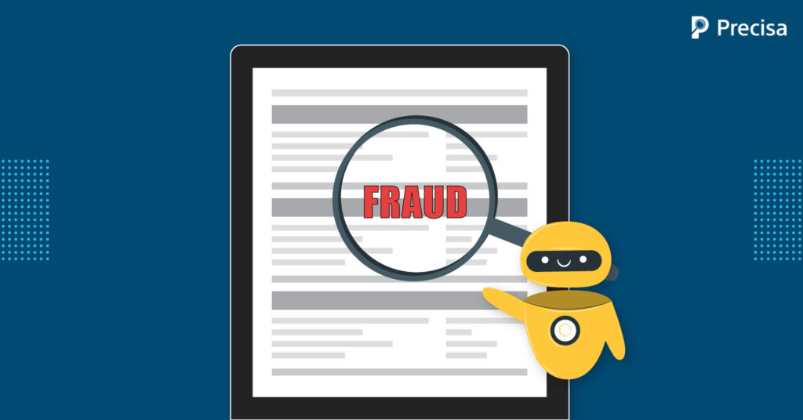

# Data Science Portfolio
---
## Exploratory Data Analysis

### Loan Defaulter Analysis (EDA)

Using some of the EDA techniques to detect the customers who are defaulters in the Loan Dataset. We will use Univariate Analysis, Bivariate Analysis & will check why the customers are defaulters & how we can avoid the loss of money.

